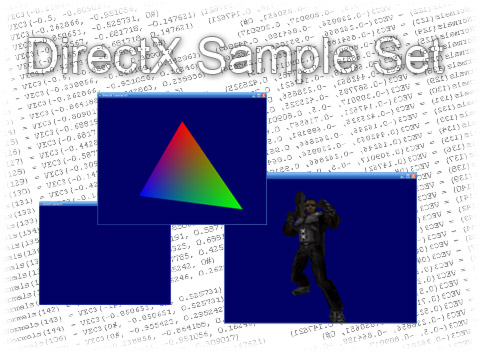



## Direct X Tutorial Set and Samples

### Description

Learn the Basics of how to render using DirectX and D3D, with 3 simple tutorials.

Here it is, I have managed to get together some of the DirectX stuff I had lying around and turn it into a tutorial set. In this set you will learn how to: 1. render a form with DirectX, 2. Render a motion object using DirectX, 3. render a MD2 Model and add motion.

This project also includes the C++ side to the MD2 Rendering. Please leave your comments etc... You might also want to check out the Readme.htm file as it contains information that I want you to be aware about&#8230; Which is helping with an Industry standard Game.

Some of the code in this project like the MD2 Modeling was not programmed by me. Please take the time to read the comments at the top of each form / module for info about authors etc&#8230;
 
### More Info
 

             |
---                |---
**Submitted On**   |2005-11-28 08:56:28
**By**             |[Dave Nedved](https://github.com/Planet-Source-Code/PSCIndex/blob/master/ByAuthor/dave-nedved.md)
**Level**          |Intermediate
**User Rating**    |5.0 (10 globes from 2 users)
**Compatibility**  |VB 6\.0
**Category**       |[DirectX](https://github.com/Planet-Source-Code/PSCIndex/blob/master/ByCategory/directx__1-44.md)
**World**          |[Visual Basic](https://github.com/Planet-Source-Code/PSCIndex/blob/master/ByWorld/visual-basic.md)
**Archive File**   |[Direct\_X\_T19523911302005\.zip](https://github.com/Planet-Source-Code/dave-nedved-direct-x-tutorial-set-and-samples__1-63424/archive/master.zip)

